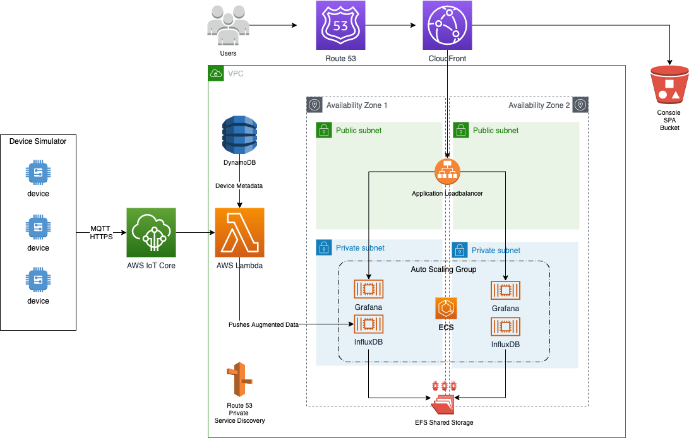
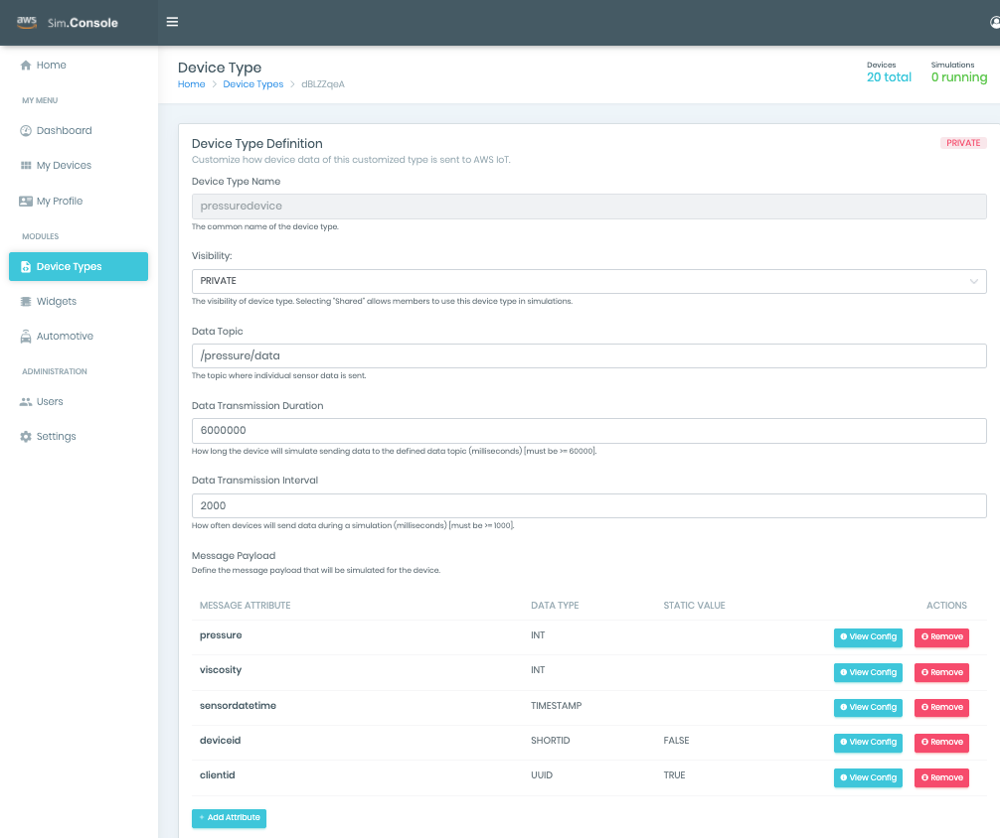
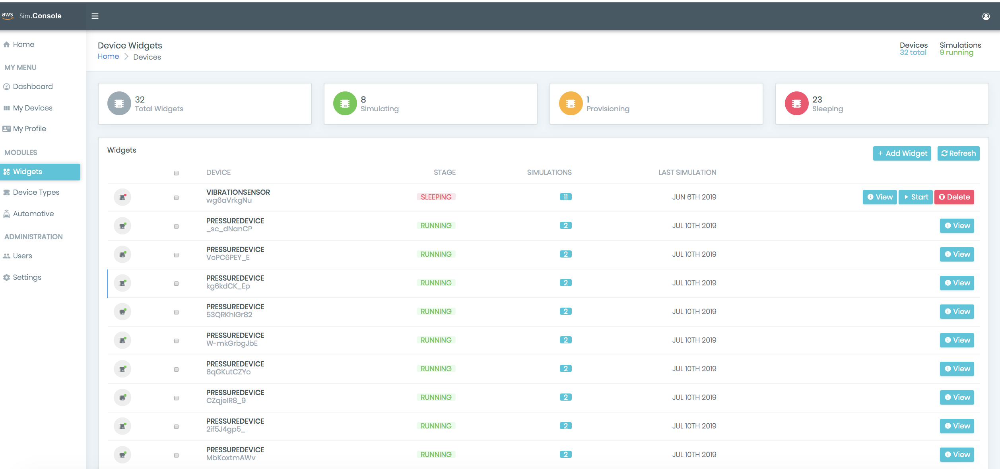
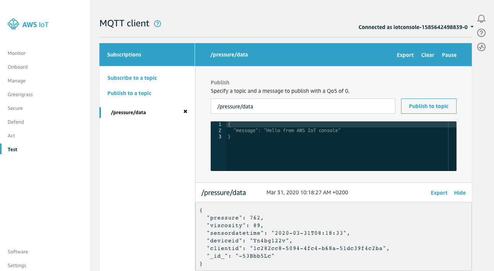
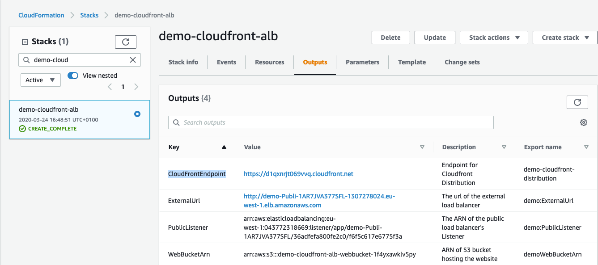
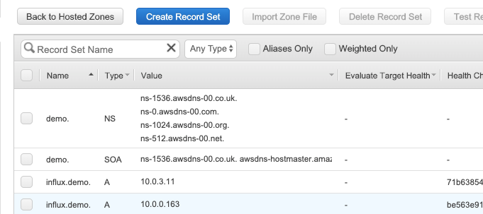
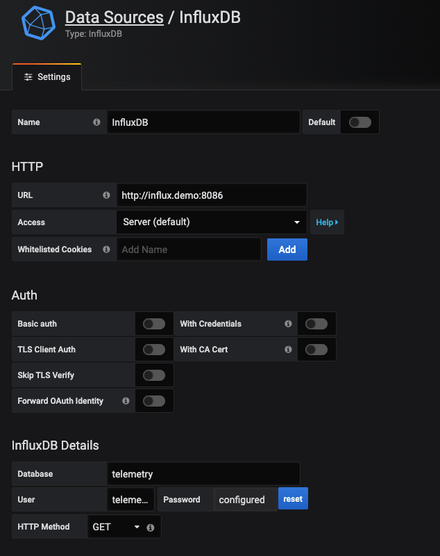
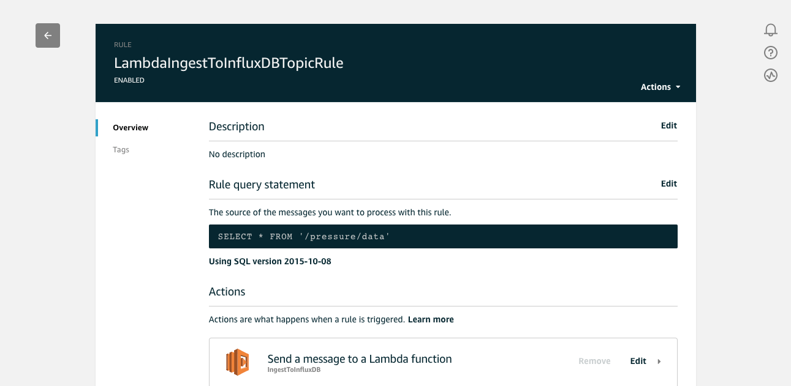
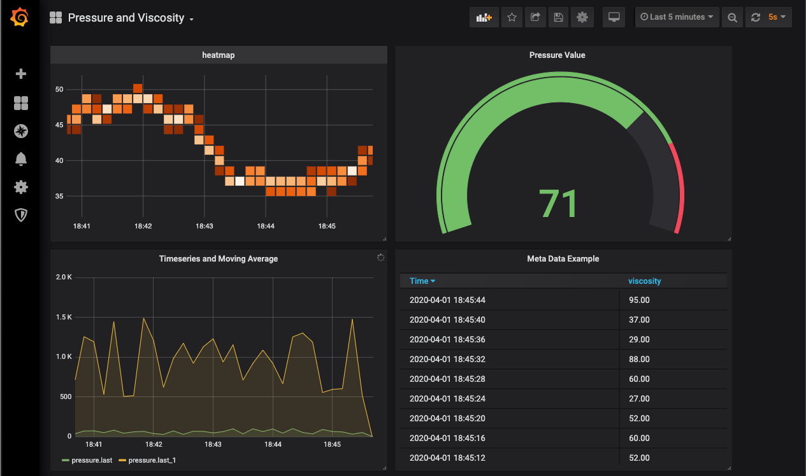
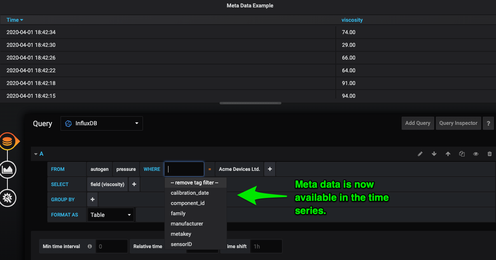

# Ingest and Enrich InfluxDB time series data with AWS IoT, Lambda and DynamoDB

This demo solution shows how to ingest and enrich realtime AWS IoT messages and deliver them to the open source [InfluxDB](https://www.influxdata.com/) timeseries database. The solution is deployed with docker containers running on an Amazon ECS cluster with auto-scaling and shared undelying EFS storage. We use the [AWS IoT Device Simulator](https://aws.amazon.com/solutions/iot-device-simulator/) to generate messages and a Lamda function pull meta data from DynamoDB and deliver the augmented messages to InfluxDB in real time. 

[Grafana](https://grafana.com/) is used to provide realtime dashboards on the incoming data. The [Chronograf](https://www.influxdata.com/time-series-platform/chronograf/) interface for InfluxDB is also deployable as a service.

Access to the system is provided through an AWS Amplify console application deployed to a CloudFront distribution. 

<center>

</center>

The solution is built from the bottom up with loosely coupled stacks for each layer:

1. Network VPC, Subnets and NatGatway
2. ECS Cluster, Autoscaling group and Service Discovery Namespace
3. EFS Shared Storage to persist container data
4. CloudFront distribution, Application Loadbalancer and S3 bucket to store the Console appliction
5. Container services for InfluxDB, Grafana and Chronograf
6. Lambda function, DynamoDB table and AWS IoT Rule to receive, enrich and publish the data to InfluxDB


## Part 1. Set up the AWS IoT Device Simulator

The first step is to [deploy the AWS IoT Device Simulator](https://aws.amazon.com/solutions/iot-device-simulator/) on the target AWS account. The AWS CloudFormation template deployment guide can be found at this link. It may take up to 15 minutes for all resources required to be provisioned. After we deploy the AWS IoT Device Simulator we create a new device type called PressureDevice. The pressure device shows up as a device type in the AWS IoT Device Simulator.


<center>

</center>

Add message attributes: pressure, viscosity, sensordatetime, deviceid, and clientid for this device type as well as the data frequency. Use the settings below and choose the data topic `/pressure/data`

Choose these data types to simulate readings coming from a device:

```json
{
  "name": "pressure",
  "_id_": "wzCHpAvdm",
  "min": 500,
  "type": "int",
  "max": 1500
}

{
  "name": "viscosity",
  "_id_": "NJJXwHTdW",
  "min": 25,
  "type": "int",
  "max": 100
}

{
  "name": "sensordatetime",
  "_id_": "QyKD1oCtd",
  "tsformat": "default",
  "type": "timestamp"
}

{
  "name": "deviceid",
  "_id_": "W4uk2jVHX",
  "static": "false",
  "type": "shortid"
}

{
  "name": "clientid",
  "_id_": "nXHjO4oTL",
  "static": true,
  "type": "uuid"
}

{
  "name": "metakey",
  "_id_": "nXHjO4oTL",
  "static": true,
  "type": "string",
  "default": "123456789"
}

```

* Note the `metakey` default value for this device is a parameter that will be used to lookup the metadata for this device in DynamoDB *

On the Widgets page of the simulator  create 20 new instances of pressure devices, which will actually start to publish data to AWS IoT Core (on the specified MQTT topic, `/pressure/data`) as soon as they are started.

<center>

</center>

Open the AWS console and go to [AWS IoT Core](https://console.aws.amazon.com/iot/home) to inspect the data we are receiving from our simulated devices.

Open the Test menu and subscribe to the topic we have specified (`/pressure/data`). You will see the traffic arrive from the devices.

<center>

</center>


Next we build out our demo solution to ingest, enrich and visualise the incoming messages.

## Part 2 Build out the solution

Clone the repository

```
git clone https://github.com/thecraic/aws-iot-influxdb-ecs-demo.git
```

#### Project Folder Structure

    .
    ├── grafana                         # Grafana sample dashboard
    ├── images                          # README and project images
    ├── infrastructure                  # Infrastructure CloudFormation templates
    ├── lambda                          # Lambda CloudFormation template and build scripts
    │   ├── ingest-to-influxdb          # NodeJs source code for Lambda function
    │── services                        # ECS service CloudFormation Templates
    │   ├── docker                      # Docker build script and container files
    │       ├── grafana-service         # Grafana docker files
    │       ├── chronograf-service      # Chronograf docker files
    └── README.md


Monitor the progress of the CloudFormation templates in the [CloudFormation Console.](https://console.aws.amazon.com/cloudformation/)

### 1. Create the network VPC, public and private subnets, Internet and NatGateways.

This is based on the [AWS VPC quickstart template](https://docs.aws.amazon.com/quickstart/latest/vpc/welcome.html), although it uses only 2 AZs:

This template creates a Multi-AZ, multi-subnet VPC infrastructure with managed NAT gateways in the public subnet for each Availability Zone. It also created private subnets in each Availability Zone where the components from the following sections will be deployed.

The infrastructure templates are located in the `infrastructure` directory.

```
cd infrastructure
aws cloudformation create-stack \
    --stack-name base-vpc-network \
    --capabilities CAPABILITY_IAM  \
    --template-body file://$PWD/network.yml
```

### 2. Create the ECS Cluster for running the services.

This template creates an EC2 ECS cluster running containers in a private subnet, with internal service discovery namespace. The service discovery namespace will allow clients to discover the InfluxDB service using DNS inside the VPC.

This configuration will create an environment called `demo`. This can be changed or replicated to dev, qa or production if using this template as the basis for a development lifecycle.

Note: 
The parameters included here allow the components in the solution to be decoupled.
However, they have connected sensible defaults.

```
aws cloudformation create-stack \
    --stack-name demo-ecs-cluster \
    --parameters  ParameterKey=EnvironmentName,ParameterValue=demo \
    --parameters  ParameterKey=NetworkStack,ParameterValue=base-vpc-network \
    --capabilities CAPABILITY_IAM  \
    --template-body file://$PWD/ecs-cluster.yml

```

### 3. Create the shared storage for containers.

This template creates an EFS network file system that will be shared by the container services. Two mount points are created, one in  each Availability Zone for High Availability. The template also creates the security group that will allow containers to access the storage.

```
aws cloudformation create-stack \
    --stack-name demo-efs-storage \
    --capabilities CAPABILITY_IAM  \
    --template-body file://$PWD/efs-storage.yml
```

### 4. Create the public facing load balancer and CloudFront distribution for the console application.

This template creates:
1. An External, public facing load balancer, for forwarding public traffic to containers. 
2. An S3 Bucket to store the static files for the Console-App. 
3. A public facing CloudFront distribution to forward traffic to the load balancer.

```
aws cloudformation create-stack \
    --stack-name demo-cloudfront-alb \
    --capabilities CAPABILITY_IAM  \
    --template-body file://$PWD/cloudfront-alb.yml
```

When the stack is complete, note the the base CloudFrontEndpoint URL in Ouputs section of the stack in the [CloudFormation Console.](https://console.aws.amazon.com/cloudformation/) , as this is how we will access the Console Application, Grafana etc. later on.


<center>

</center>


### 5. Create the InfluxDB service.

This template creates an Auto-Scaled ECS service for InfluxDB across the two Availability Zones. The storage from step 3 is mounted on each docker container allowing the InfluxDB to share the data access. The docker image used is the publicly available image from dockerhub `influxdb:1.7.10`.

The services are located in the `services` directory.

```
cd ../services
aws cloudformation create-stack \
    --stack-name demo-influxdb-service \
    --capabilities CAPABILITY_IAM  \
    --template-body file://$PWD/influxdb-service.yml
```

The service discovery system provides a DNS name space for applications that will communicate with one or other of the InfluxDB instances. The domain is the parameter EnvironmentName, in this case `demo`. The service is `influx`. 
This can be seen in the Route53 Console, under Hosted Zones.

<center>

</center>

Now, requests to the InfluxDB containers will be routed by private DNS to `influx.demo`

### 6. Build and push the grafana service docker container to Amazon ECR

This step will create an ECR repository called `grafana-service` , build the docker container and put it to the repository.

From the `services/docker` directory run the command:

```
./build-and-push.sh grafana-service
```
Once done you are now ready to create and deply the Grafana service.

### 7. Create and configure the Grafana service:

The Grafana service will sit sit behind the public loadbalancer created in step 3.

```
aws cloudformation create-stack \
    --stack-name demo-grafana-service \
    --capabilities CAPABILITY_IAM  \
    --template-body file://$PWD/grafana-service.yml
```

Open a browser to the CloudFront URL from step 4 to the https://CloudFrontEndpointURL`/grafana`

You can `root` for username and `root` for the password to log in for the first time. You may be asked to change the password.

Add the Influxdb service as a data source in the newly created Grafana. By default we have created a database called `telemetry` with user `telemetry` and password `telemetry`. 

The InfluxDB service is available to Grafana at `http://influx.demo:8060`. This communication happens within the private subnet of the VPC only.

Note: Make sure to call the datasource `InfluxDB` because this will be needed later when importing the Grafana dashboard.

<center>

</center>

### 8. Create a Lambda function to enrich and push IoT messages to Influxdb

First we create the base Lambda function and IoT Rule that will deliver messages as they are received from IoT devices. This template will also create a DynamoDB table to hold the device metadata that will be used to enrich the incoming messages.

The Lambda code is located in the `lambda` directory:
```
cd ../lambda
aws cloudformation create-stack \
    --stack-name demo-iot-lambda-influxdb \
    --capabilities CAPABILITY_IAM  \
    --template-body file://$PWD/ingest-to-influxdb.yml    
```

When this is complete you can view the function in the [Lamda Console.](https://console.aws.amazon.com/lambda/) 

Now we can deploy the lambda function code:

From the `lambda` directory run the command:
```
./build_and_update.sh
```

The Lambda function code in `ingest-to-influxdb/index.js` pull from the DynamoDB table any metadata associated with the `metakey` field present in the device information.

The function is deployed with network interfaces in the private subnets of the VPC. This means it could be used to pull metadata information from other data sources located in these subnets, for example from an RDS instance.

```javascript
const Influx = require('influx');

const AWS = require("aws-sdk");
const dynamodb = new AWS.DynamoDB();

//This code writes data from IoT core rule via Lambda into InfluxDB
//It checks the incoming messages for deviceid and clientid
//Any metadata associated with these items are added to the messages

exports.handler = (event, context, callback) => {

    console.log(event);
    var pressureInputValue = JSON.parse(event.pressure);
    var viscosityInputValue = JSON.parse(event.viscosity);
    //Create clientID
    var clientid = JSON.stringify(event.clientid);
    var deviceid = JSON.stringify(event.deviceid);
    var sensorID = deviceid+clientid; 

    var schema_tags = ['sensorID'];
    let meta_tags = new Object();
    meta_tags["sensorID"]=sensorID;
    
    // Look for metadata in DynamoDB
    var params = { }
    params.TableName = process.env.DYNAMODB_TABLE;
    var key = { "metakey": {"S":event.metakey} };
    params.Key = key;
    
    dynamodb.getItem(params, function(err, data) {
        
        
        if (err) console.log(err);
        else {
            console.log(data);
            var item = AWS.DynamoDB.Converter.unmarshall(data.Item);
            console.log(item);
            
            for (var tag in item) {
                schema_tags.push(tag);
                var tag_value=item[tag];
                console.log(tag + " : " + tag_value);
               
                meta_tags[tag]=tag_value;
            }
        }
        
        // write to influx regardless
        var result = writeToInfluxDB (schema_tags,pressureInputValue, viscosityInputValue, meta_tags);
        callback(null, result);

    });
    
  };

function writeToInfluxDB(schema_tags,pressureVar, viscosityVar, tags )
{
    console.log("Executing Influx insert");

    const client = new Influx.InfluxDB({
        database: process.env.INFLUXDB,
        username: process.env.INFLUXDBUSRNAME,
        password: process.env.INFLUXDBPWD,
        port: process.env.INFLUXDBPORT,
        hosts: [{ host: process.env.INFLUXDBHOST }],
        schema: [{
            measurement: 'pressure',
    
            fields: {
                pressureValue: Influx.FieldType.FLOAT, 
                viscosity: Influx.FieldType.FLOAT,
            },
    
            tags: schema_tags
        }]
    });
    
    client.writePoints([{
        measurement: 'pressure', fields: { pressureValue: pressureVar, viscosity: viscosityVar},
        tags: tags
    }]) 
    console.log("Finished executing");
}  
```

When complete, the rule that pushes the AWS IoT core messages to Lambda for augmentation and delivery to InfluxDB can be seen in the AWS IoT console user the Act Page.

<center>

</center>

### 9. Add  metadata to DynamoDB 

Here we use the AWS CLI to add a record to DynamoDB with a metakey matching the device type we configured in the earlier steps.

```json
aws dynamodb put-item \
    --table-name demo-DeviceMetaData \
    --item '
{
  "metakey": {
    "S": "123456790"
  },
  "manufacturer": {
    "S": "Acme Devices Ltd."
  },
  "family": {
    "S": "sensors"
  },
  "component_id": {
    "S": "a1b2c3d4"
  },
  "calibration_date": {
    "S": "2020-09-25"
  }
}'

```


### 10. Import the sample dashboard into Grafana

To begin seeing the in coming data in real time with Grafana, a sample dashbpatd is provided.
In Grafana choose Import Dashboard and upload the file from `grafana\dashboard.json`.

<center>

</center>


The enriched data fields (in this case as tags) are also available in the timeseries data as it arrives into InfluxDB.

<center>

</center>


